# Court Reporting Apps - Visual Walkthrough

## Step 1: Create a new job

Click the **Create Job** button. Fill in the case name, duration, location type, and city. Then click **Create**.

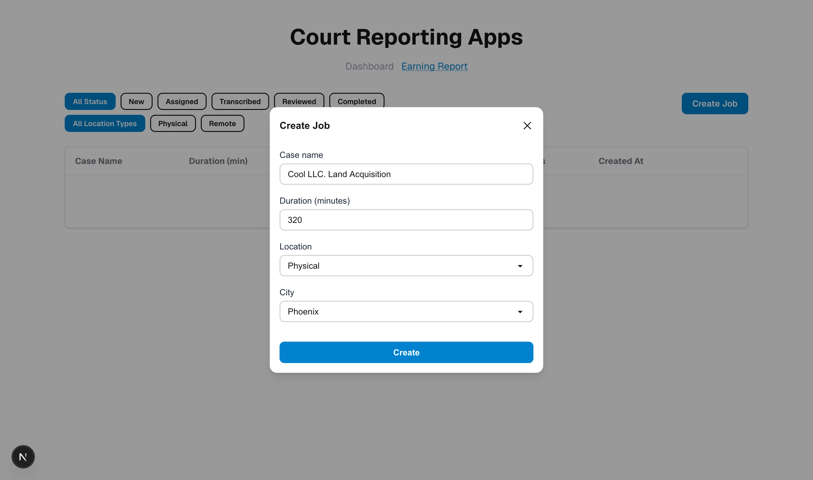

---

## Step 2: Job created

The new job shows up in the list with status **New**.

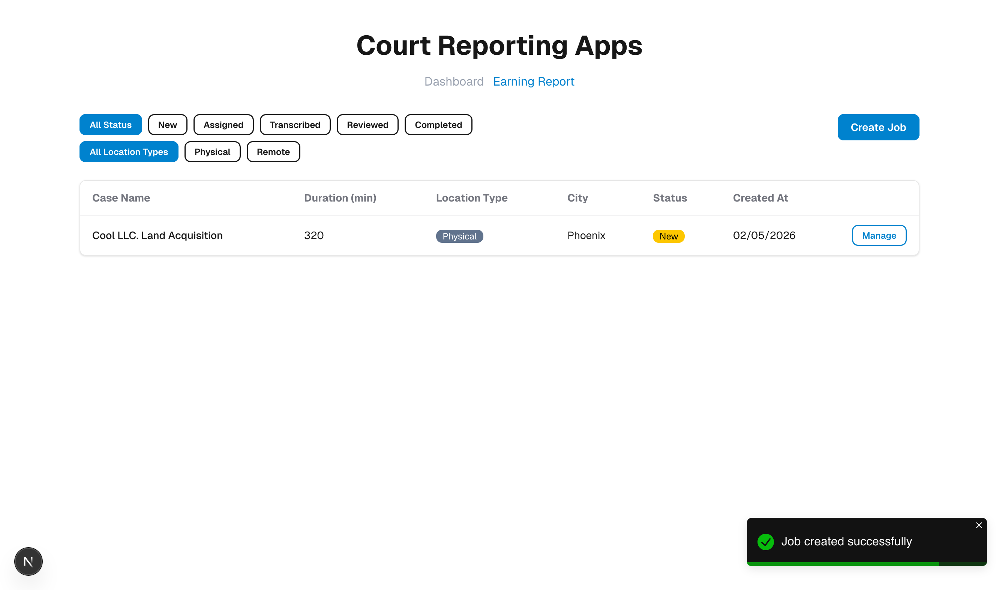

---

## Step 3: Open the job

Click **Manage** on the job. You will see the job details and the **Assign Reporter** section.

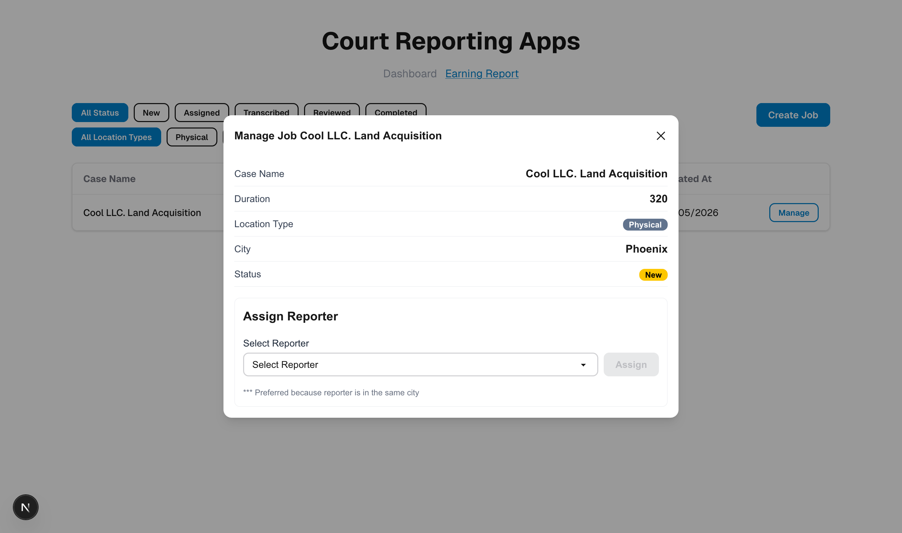

---

## Step 4: Pick a reporter

Choose a reporter from the dropdown. Reporters with `***` are from the same city, so they are preferred.

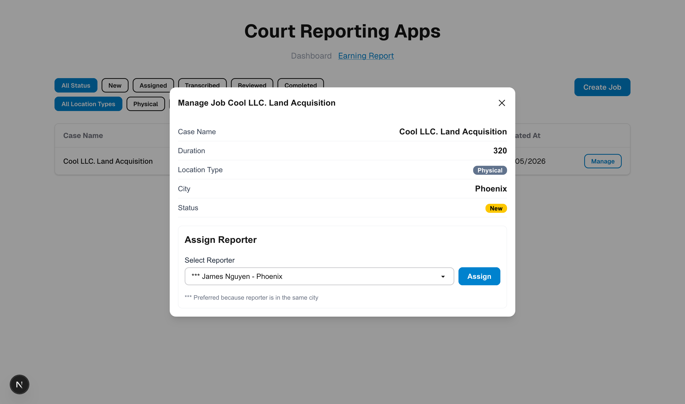

---

## Step 5: Reporter is assigned

The status changes to **Assigned**. When the reporter finishes the transcript, click **Mark as Transcribed**.

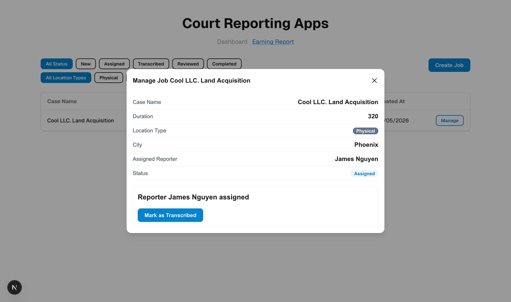

---

## Step 6: Pick an editor

Now pick an editor from the dropdown and click **Assign**.

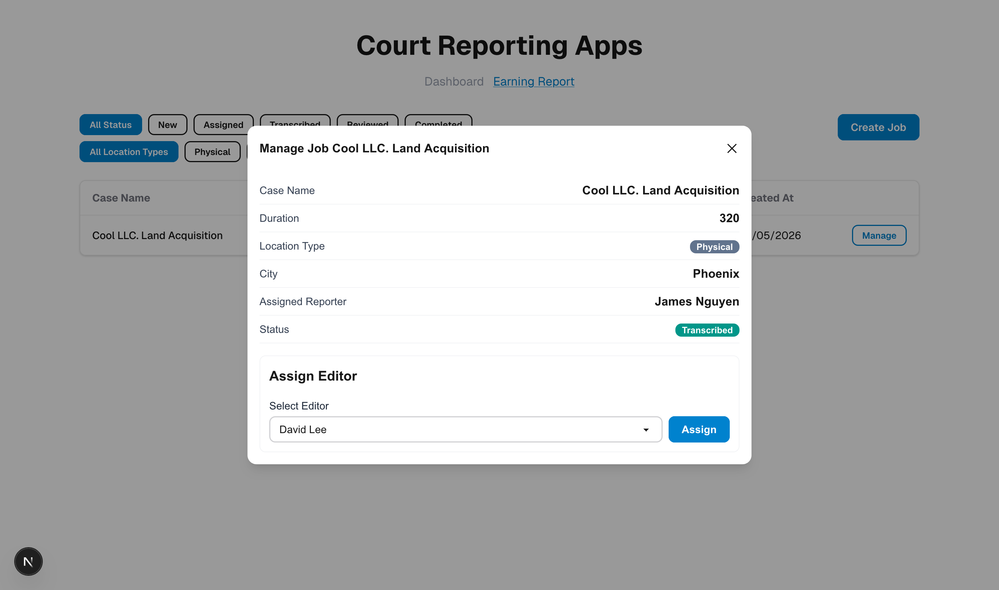

---

## Step 7: Editor is assigned

The editor is saved. Click **Mark as Reviewed** when the review is done.

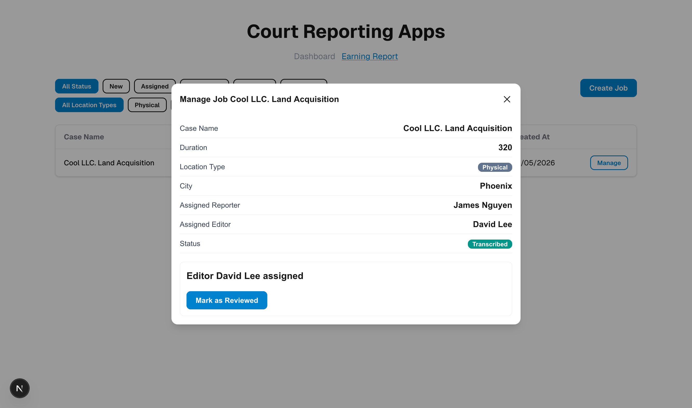

---

## Step 8: Calculate the payment

Type the reporter rate per minute and the editor flat fee. Then click **Calculate Payment**.

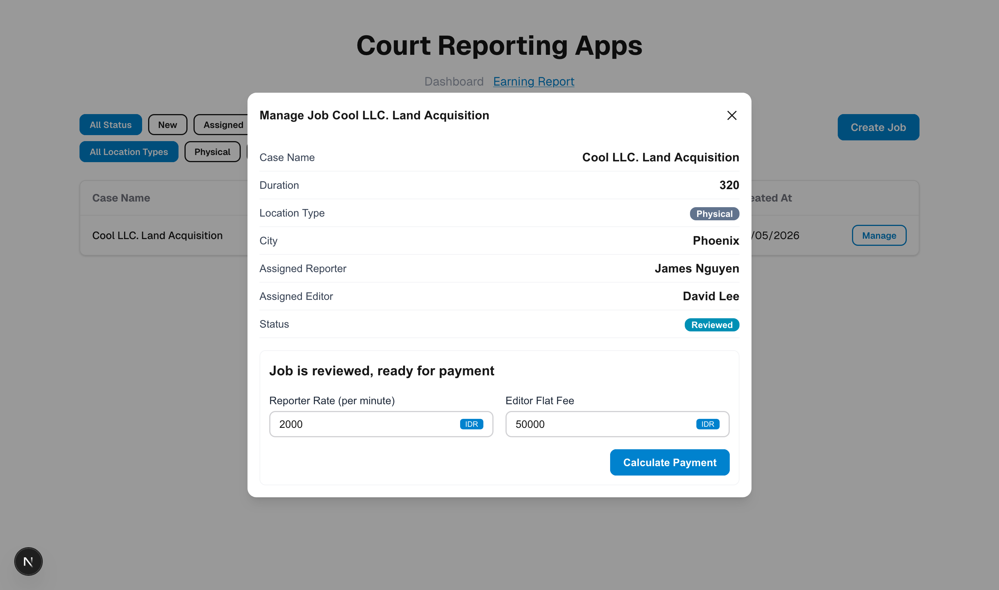

---

## Step 9: Check the payment preview

You can see the total payment before you confirm. Click **Process Payment** to finish.

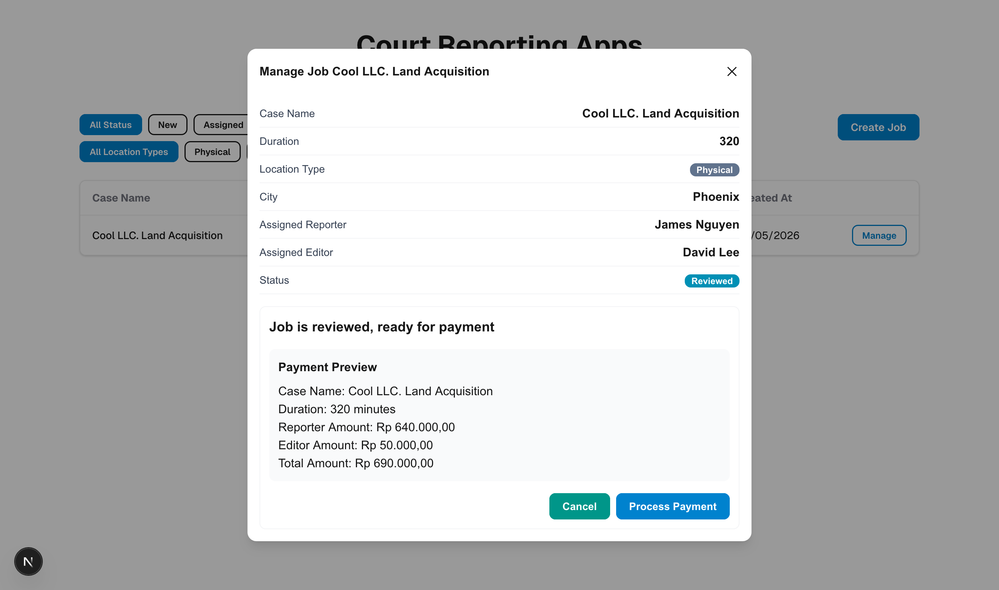

---

## Step 10: Payment done

The job status is now **Completed** and you see a success message.

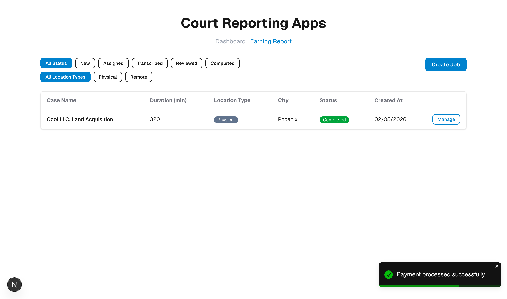

---

## Step 11: Payment details

Click **Manage** on a completed job to see the payment ID and all the amounts.

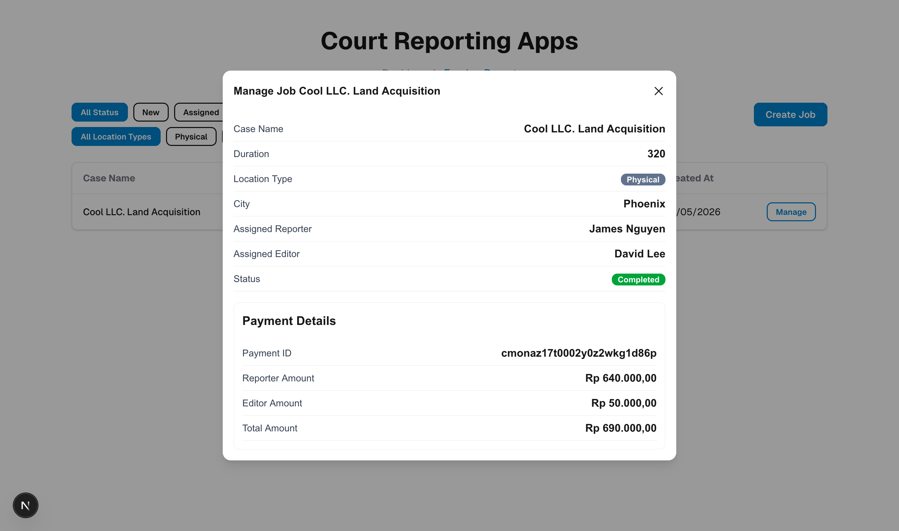

---

## Step 12: Earning Report

Go to the **Earning Report** page to see all completed jobs and their fees.

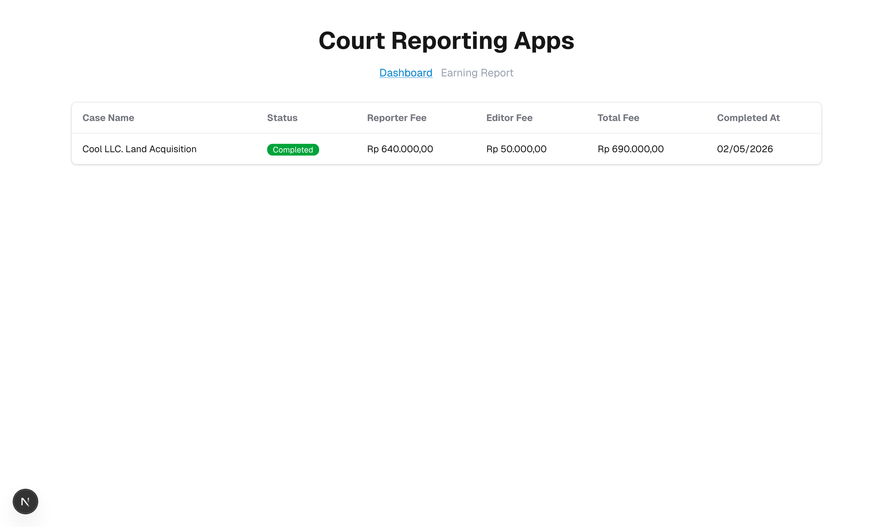
